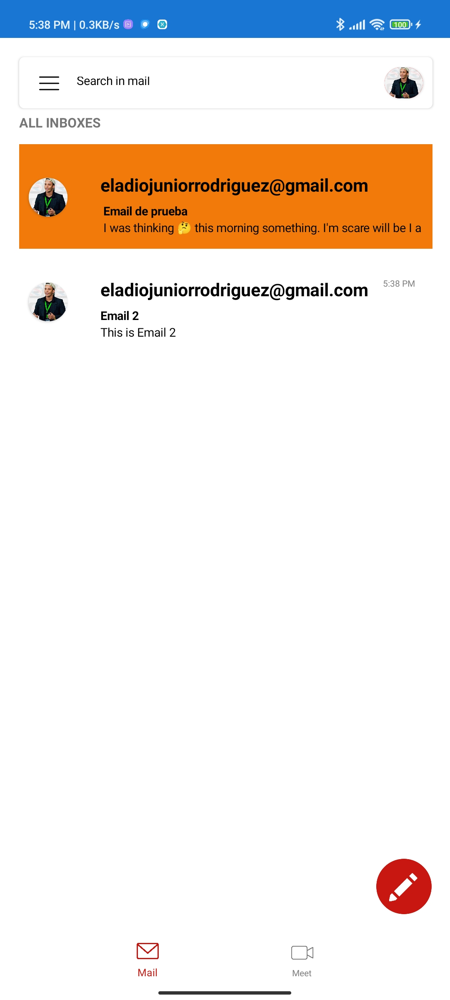
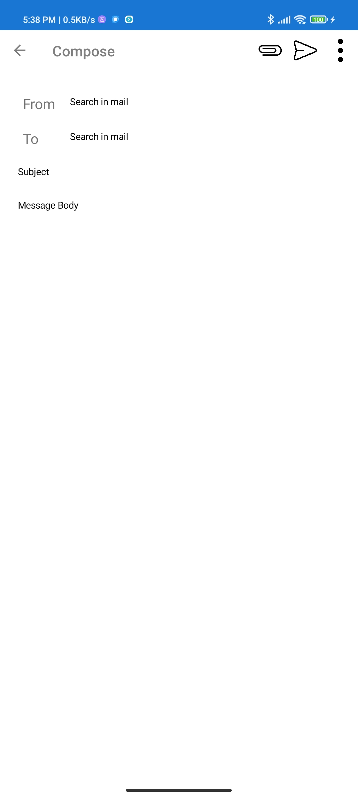
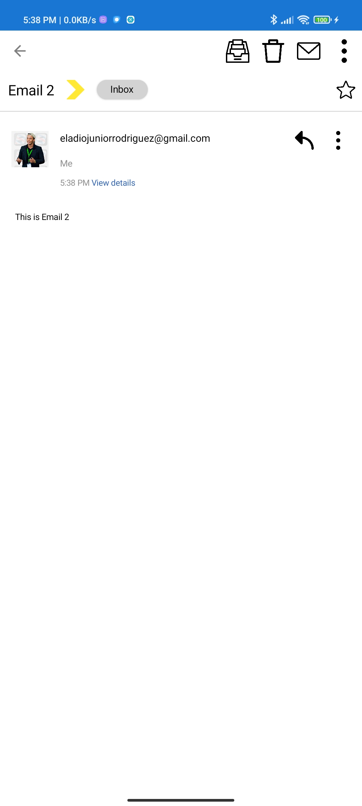
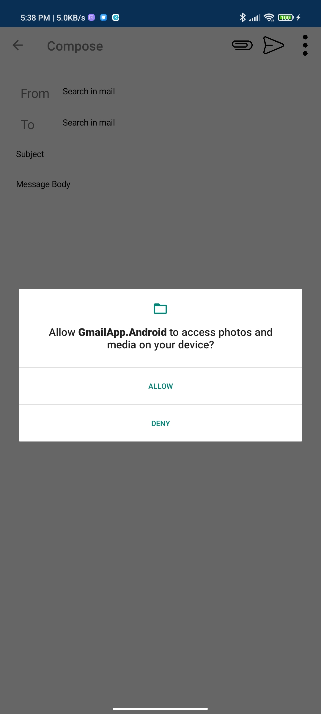
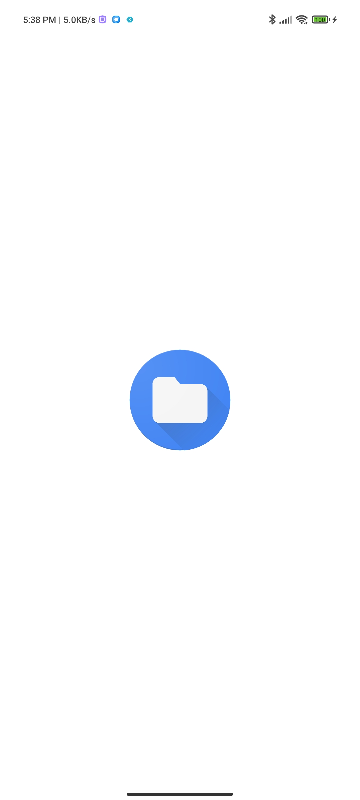
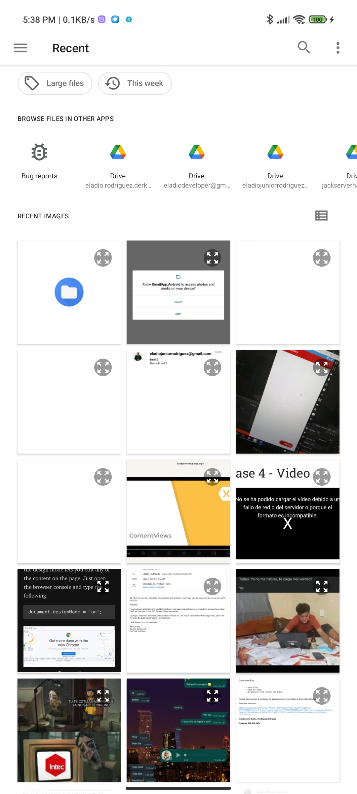

# GMAIL APP

Gmail Replicate App Clone using Xamarin Forms

Web App Reference [gmail.com](https://play.google.com/store/apps/details?id=com.google.android.gm&hl=es_DO&gl=US)

## Screenshots / Clone APP

 

    
    
    
    
    
    

## Tools used

- **NETStandar.Library** - A set of standard .NET APIs that are prescribed to be used and supported together.
<https://dotnet.microsoft.com/>

- **PropertyChanged.Fody** - Add property notification to all classes that implement INotifyPropertyChanged.
<https://github.com/Fody/PropertyChanged>

- **Xam.Plugins.Notifier** - The local notification plugin provides a simple, cross-platform way to show local notifications from within Xamarin and UWP apps.
<https://github.com/edsnider/LocalNotificationsPlugin>

- **Xamarin.CommunityToolkit** - The Xamarin Community Toolkit is a collection of Animations, Behaviors, Converters, and Effects for mobile development with Xamarin.Forms. It simplifies and demonstrates common developer tasks building iOS, Android, and UWP apps with Xamarin.Forms.
<https://github.com/xamarin/XamarinCommunityToolkit>

- **Xamarin.Essentials** -  Essential cross platform APIs for yout mobile apps. https://github.com/xamarin/Essentials
<https://github.com/xamarin/Essentials>

- **Xamarin.Forms** - Build native UIs for iOS, ANdroid, UWP, macOS, Tizen and manu more from a single, shared C# codebase.
<https://github.com/xamarin/Xamarin.Forms>
